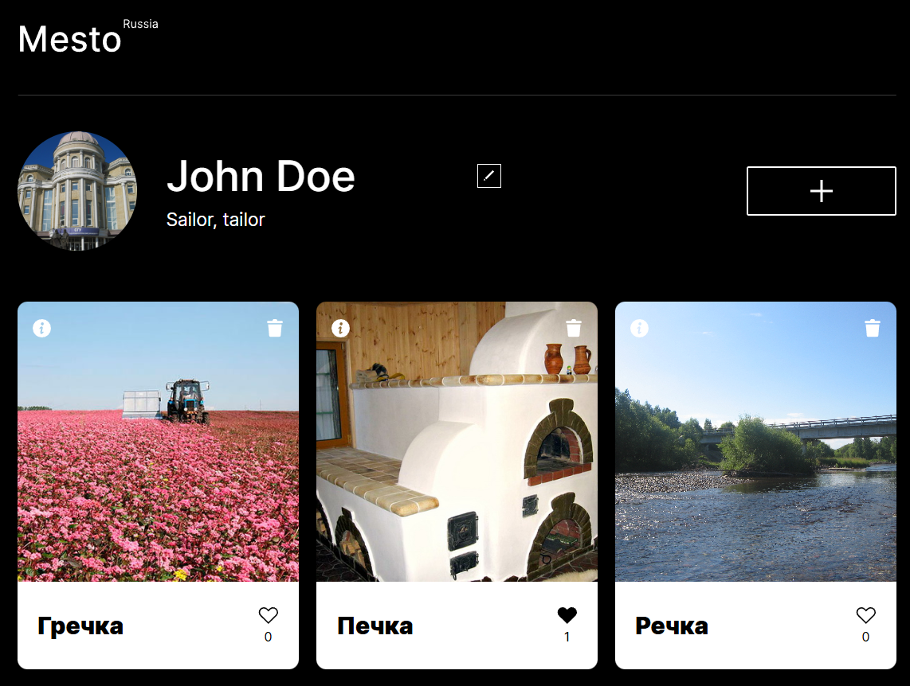

### Учебный проект ассоциированных программ Яндекса и СГУ

**Mesto** — приложение для обмена фотографиями различных мест. Пользователи могут редактировать собственный профиль, добавлять/удалять карточки, ставить лайки, а также просматривать информацию о карточках.

---

Ссылка на Github Pages: https://ratbeater68.github.io/mesto-prod
